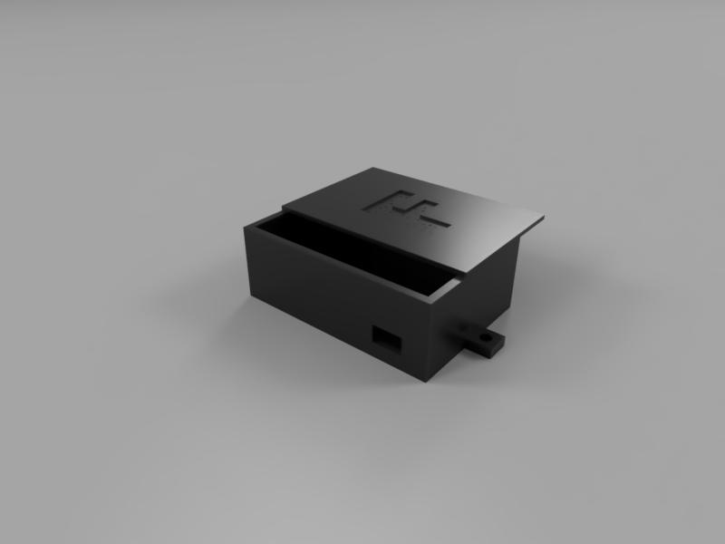

# Obudowa Mikrokontrolera (Fusion 360)

Projek obudowy z górną pokrywką, zaprojektowany w programie Autodesk Fusion 360. Obudowa została stworzona z myślą o zabezpieczeniu układów elektronicznych (np. mikrokontrolerów).

## 🛠️ Wykorzystane technologie
* **CAD:** Autodesk Fusion 360
* **Formaty:** Udostępniono plik `.step`, uniwersalny i gotowy do edycji w dowolnym programie inżynierskim.

## 📏 Wymiary obudowy
* **Wymiar zewnętrzny :** 84x55x30 mm
* **Wymiar wewnętrzny:** 78x52x27 mm 
